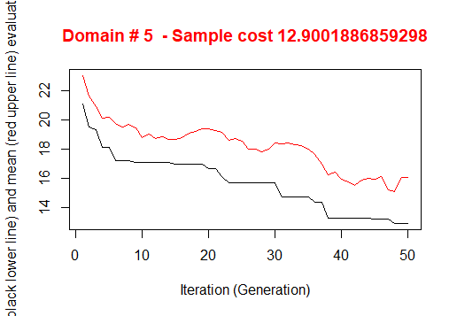
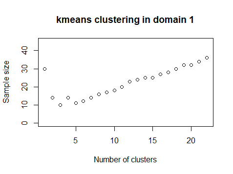
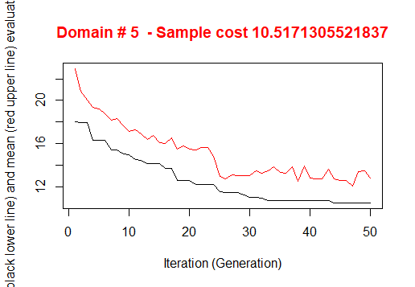
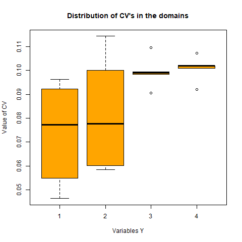
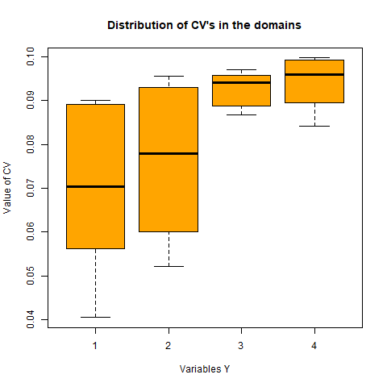

```{r setup, include=FALSE}
knitr::opts_chunk$set(
  comment = "#>",
  fig.align = "centre",
  fig.height = 4,
  message = FALSE,
  warning = FALSE,
  error = FALSE)

```

```{r, include = F}
# Run for internal use (not shown on slides)
library(SamplingStrata)
load("Nations.RData")
```

## Dataset "nations"

- Data on 207 countries related to demographic variables


```{r, eval = T}
data(nations)
head(nations)
```

## Step 1: derive 'sampling frame' from dataset

```{r, eval = T}
library(SamplingStrata)
frame <- buildFrameDF(nations,
                      id="Country",
                      X="Country",
                      Y=c("TFR","contraception",
                          "infant.mortality","GDP"),
                      domainvalue = "Continent")

head(frame)
```

## Step 2: derive 'strata' from the frame

```{r, eval = T}
strata <- buildStrataDF(frame, progress = FALSE)
head(strata)
```

## Step 3: definition of precision constraints

```{r, eval = T}
cv <- as.data.frame(list(DOM=rep("DOM1",5),
                         CV1=rep(0.1,5),
                         CV2=rep(0.1,5),
                         CV3=rep(0.1,5),
                         CV4=rep(0.1,5),
                         domainvalue=c(1:5)
                             ))
cv
```

## Step 4: Optimization

```{r, eval = F}
solution1 <-
	optimizeStrata(
	errors = cv , 
	strata = strata, 
	iter = 50, 
	pops = 20, 
	suggestions = NULL,
	showPlot = FALSE,
	writeFiles = FALSE)
```

## Solution

```{r, out.width = "400px", echo = FALSE}

```
```{r, eval = T}
sum(ceiling(solution1$aggr_strata$SOLUZ))	
nrow(solution1$aggr_strata)	

```

## Initial suggestion with kmeans

```{r, eval = T}
kmean <- KmeansSolution(strata, cv, nstrata=NA, showPlot = F)
```

## Best kmeans solution

```{r, out.width = "500px", echo = FALSE}

```

## Step 4: Optimization

```{r, eval = F}
solution2 <-
	optimizeStrata(
	errors = cv , 
	strata = strata, 
	iter = 50, 
	pops = 20, 
	suggestions = kmean,
	showPlot = FALSE,
	writeFiles = FALSE)
```

## New solution with initial suggestion

```{r, out.width = "400px", echo = FALSE}

```
```{r, eval = T}
sum(ceiling(solution2$aggr_strata$SOLUZ))	
nrow(solution2$aggr_strata)	
```

## Step 5: expected CV

```{r, eval = F}
newstrata <- updateStrata(strata,solution2)
framenew <- updateFrame(frame,newstrata)
results1 <- evalSolution(framenew, solution2$aggr_strata, 
                         200, writeFiles=TRUE)
```
```{r, eval = T}
results1$coeff_var
```

## CV

```{r, out.width = "400px", echo = FALSE}

```

## Improving expected CV

```{r, eval = F}
oustrata <- solution2$aggr_strata
outstrata$SOLUZ <- ceiling(solution2$aggr_strata$SOLUZ)
results2 <- evalSolution(framenew, outstrata, 200, writeFiles=TRUE)
```
```{r, eval = T}
results2$coeff_var
```

## CV

```{r, out.width = "400px", echo = FALSE}

```
